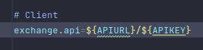

# Java RestAPI - Api for foreign exchange rates and currency conversion

Patterns: Singleton, Strategy, Facade

<p align="">
   <a alt="Ubuntu">
        
    </a>
     <a alt="Java">
        
    </a>
    <a alt="Spring Boot">
        
    </a>
    <a alt="Gradle">
        
    </a>
    <a alt="OpenFeign">
        
    </a>
    <a alt="Swagger">
        
    </a>
    <a alt="Mockito">
        
    </a>
    <a alt="Rest-Assured">
        
    </a>
</p>

## About this application

#### Currency Conversion System and Calculation of the Total Price of a Product Depending on the Chosen Currency
- supported currencies: ARS, BRL, EUR, GBP, JPY, USD


When the customer adds a product, all information, including the currency, is saved in the database.

This API is for consultation only; selecting the currency at the time of the inquiry does not alter the information in the database. To change the currency of your product's price, an update is required.

However, this application also allows you to check the current exchange rate based on the available currencies, data sourced from the exchange-rate API.


### Ready to be accessed and tested
obs: when the free trial of the Railway platform ends, the link will be deactivated. in this case, it will be necessary to run the application to access the Swagger documentation
> https://exchange-rate.up.railway.app/swagger-ui/index.html
---

### Integrations
#### [Exchangerate-API] Third-part API
- [API Documentation](https://www.exchangerate-api.com/docs/overview)
- [API Registration](https://app.exchangerate-api.com/sign-up) : get key

#### [Railway Platform]  Cloud/CI/Deploy
- [Railway Documentation](https://railway.app/)

---
## How To

clone

```bash
  git clone git@github.com:bianavic/java-exchange-rate.git
```

access

```bash
  cd java-exchange-rate
```
ps: before executing this project, make sure you configure your api key at application.properties file



execute
```bash
./gradlew bootrun
```

---
### Exchange Rate Endpoints

#### standard conversion

```bash
curl -X 'GET' \
  'http://localhost:8282/latest/EUR' \
  -H 'accept: */*'
  ```

| Parameter     | Type     | Description                   |
|:--------------|:---------|:------------------------------|
| `base_code`   | `String` | **Required**. Código da moeda |

###### 200 OK
ps: return all supported currencies from exchange rate api

``` json
{
 "result":"success",
 "documentation":"https://www.exchangerate-api.com/docs",
 "terms_of_use":"https://www.exchangerate-api.com/terms",
 "time_last_update_unix":1699142401,
 "time_last_update_utc":"Sun, 05 Nov 2023 00:00:01 +0000",
 "time_next_update_unix":1699228801,
 "time_next_update_utc":"Mon, 06 Nov 2023 00:00:01 +0000",
 "base_code":"EUR",
 "conversion_rates":{
  "EUR":1,
  "AED":3.9287,
  "AFN":78.3934,
  "ALL":105.5830,
  "AMD":427.5039,
  "ANG":1.9149,
  "AOA":894.1269,
  "ARS":374.4460,
  "AUD":1.6491,
  "AWG":1.9149,
  "AZN":1.8050,
  "BAM":1.9558,
  "BBD":2.1395,
  ...
 }
}
```
###### 400 BAD_REQUEST

``` json
Invalid currency code. Currency code must be a valid ISO 4217 code: QQQ
```
#### pair conversion

```bash
curl -X 'GET' \
  'http://localhost:8282/pair/BRL/USD' \
  -H 'accept: */*'
  ```

| Parameter     | Type     | Description                   |
|:--------------|:---------|:------------------------------|
| `base_code`   | `String` | **Required**. Código da moeda |
| `target_code` | `String` | **Required**. Código da moeda |

###### 200 OK

``` json
{"base_code":"BRL","target_code":"USD","conversion_rate":0.2024,"time_last_update_utc":"Sun, 05 Nov 2023 00:00:01 +0000"}
```

#### pair conversion base amount
```bash
curl -X 'GET' \
  'http://localhost:8282/pair/BRL/USD/1000' \
  -H 'accept: */*'
  ```

| Parameter     | Type         | Description                   |
|:--------------|:-------------|:------------------------------|
| `base_code`   | `String`     | **Required**. Código da moeda |
| `target_code` | `String`     | **Required**. Código da moeda |
| `amount`      | `BigDecimal` | **Required**. Código da moeda |

###### 200 OK

``` json
{"base_code":"BRL","target_code":"USD","conversion_rate":0.2024,"conversion_result":202.4,"time_last_update_utc":"Sun, 05 Nov 2023 00:00:01 +0000"}
```
###### 400 BAD_REQUEST

``` json
Invalid amount: -1
```
---
### Product Endpoints

#### add a product

```bash
curl -X 'POST' \
  'http://localhost:8282/products' \
  -H 'accept: */*' \
  -H 'Content-Type: application/json' \
  -d '{
  "name": "product 1",
  "description": "product description 1",
  "quantity": 1,
  "price": 100,
  "currency": "USD"
}'
  ```

| Parameter     | Type         | Description                                               |
|:--------------|:-------------|:----------------------------------------------------------|
| `id`          | `Long`       | **NOT Required**. product id                              |
| `name`        | `String`     | **Required**. product name                                |
| `description` | `String`     | **Required**. product description                         |
| `quantity`    | `Integer`    | **Required**. product quantity                            |
| `price`       | `BigDecimal` | **Required**. product price                               |
| `currency`    | `BigDecimal` | **Required**. product currency will not be converted here |

###### 200 OK

``` json
{
  "id": 1,
  "name": "product 1",
  "description": "product description 1",
  "quantity": 10,
  "price": 100,
  "currency": "USD"
}
```
###### 400 BAD_REQUEST

``` json
{
  "status": 400,
  "message": "{quantity=must be greater than 0, price=must be greater than 0, name=name is mandatory}",
  "timeStamp": 1700157182686
}
```
#### get all products

```bash
curl -X 'GET' \
  'http://localhost:8282/products' \
  -H 'accept: */*'
```

###### 200 OK

``` json
[
  {
    "id": 1,
    "name": "product 1",
    "description": "product description 1",
    "quantity": 10,
    "price": 100,
    "currency": "USD"
  },
  {
    "id": 2,
    "name": "product 2",
    "description": "product description 2",
    "quantity": 20,
    "price": 200,
    "currency": "ARS"
  }
]
```
#### get product by ID

```bash
curl -X 'GET' \
  'http://localhost:8282/products/2' \
  -H 'accept: */*'
```

###### 200 OK

``` json
{
  "id": 2,
  "name": "product 2",
  "description": "product description 2",
  "quantity": 20,
  "price": 200,
  "currency": "ARS"
}
```
###### 404 NOT_FOUND

``` json
Resource ID not found: 1
```
#### update product by ID

```bash
curl -X 'PUT' \
  'http://localhost:8282/products/2' \
  -H 'accept: */*' \
  -H 'Content-Type: application/json' \
  -d '{
  "quantity": 100,
  "price": 99.99,
  "currency": "USD"
}'
  ```

| Parameter     | Type         | Description                                               |
|:--------------|:-------------|:----------------------------------------------------------|
| `quantity`    | `Integer`    | **Required**. product quantity                            |
| `price`       | `BigDecimal` | **Required**. product price                               |
| `currency`    | `BigDecimal` | **Required**. product currency will not be converted here |

###### 200 OK

``` json
{
  "quantity": 100,
  "price": 99.99,
  "currency": "USD"
}
```

###### 400 BAD_REQUEST

``` json
Invalid currency code. Currency code must be a valid ISO 4217 code: AR
```
###### 400 BAD_REQUEST

``` json
{
  "status": 400,
  "message": "{quantity=must be greater than or equal to 1, price=must be greater than or equal to 0}",
  "timeStamp": 1700157002947
}
```
###### 404 NOT_FOUND

``` json
Resource ID not found: 1
```
#### delete product by ID

```bash
curl -X 'DELETE' \
  'http://localhost:8282/products/2' \
  -H 'accept: */*'
```

###### 200 OK
###### 404 NOT_FOUND

``` json
Resource ID not found: 1
```
#### convert total product price to supported currency

```bash
curl -X 'GET' \
  'http://localhost:8282/products/1/totalPrice/BRL' \
  -H 'accept: */*'
  ```

| Parameter    | Type         | Description                   |
|:-----------------|:-------------|:------------------------------|
| `id`             | `Long`       | **Required**. product id      |
| `targetCurrency` | `String`     | **Required**. currency symbol |

###### 200 OK

``` json
4941.7
```
###### 404 NOT_FOUND

``` json
can't parse JSON.  Raw result:
Resource ID not found: 1
```

## Code Coverage Report


## Swagger Documentation
when running this application, you can test and visualize at:
[Documentação do Swagger](http://localhost:8282/swagger-ui/index.html)
